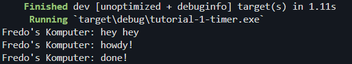
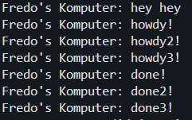

Output dari tutorial-1-timer:

Penjelasan: karena kita menerapkan asynchronous programming dimana program men-spawn sebuah fungsi asinkronus dan fungsi tersebut dieksekusi saat `executor.run()`. Akibatnya program `main` akan mencetak `Fredo's Komputer: hey hey` 2 detik sebelum `Fredo's Komputer: done!`.  

Setelah melakukan spawn beberapa kali secara bersamaan dan menghilangkan `drop(spawner)`, ternyata outputnya berikut:

Penjelasan: ketika `executor.run()` berjalan, ketiga fungsi asinkronus yang sudah di spawn sebelumnya akan dijalankan secara bersamaan layaknya thread. Akibatnya semua `howdy` akan dicetak terlebih dahulu. Setelah 2 detik barulah `done` akan dicetak. Selain itu, program juga tidak berhenti karena `drop(spawner)` yang dihilangkan membuat executor masih mengunggu task lain yang akan datang.